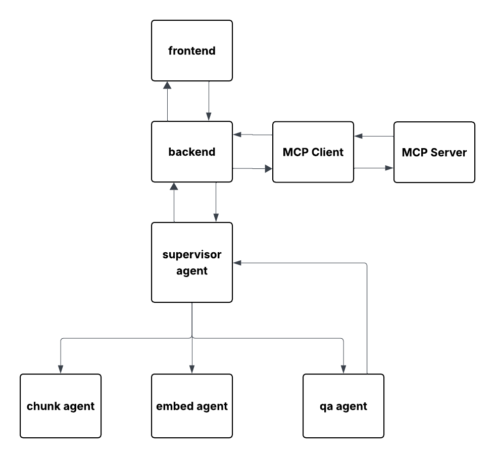

# Legal Document Analyzer

This project is an intelligent legal document analyzer. 
It uses a multi-agent architecture to process legal PDFs, store their semantic representations in a vector database, 
and extract meaningful summaries or key points using OpenAI's GPT models and has a legal term lookup based on wikipedia search.

---

## 🚀 Features

- Multi-agent architecture using LangGraph and LangChain
- PDF document parsing and chunking
- Legal term Lookup via wikipedia (MCP integration)
- Vector database storage
- Question answering via retrieval-augmented generation (RAG)
- Frontend powered by Next.jS
- LangSmith tracing support

---

## Project Structure

```bash
legal-document-analyzer/
├── agents/                  # Agent definitions and tools
├── frontend/                # Next.js frontend (not shown here)
├── mcp/                     # Multi-Agent Communication Protocol components
├── rag_utils/              # PDF reading utilities
├── uploaded_pdfs/          # Directory to hold uploaded PDFs
├── vectorstore/            # Vector database files
├── app.py                  # Main FastAPI app entry point
├── requirements.txt        # Python dependencies
├── README.md               # You're here
└── .env                    # Environment variables
```

---
### Environment Setup

To run the project, create a `.env` file in the root directory and add the following variables:

```bash
LANGSMITH_TRACING=true
LANGSMITH_ENDPOINT=https://api.smith.langchain.com
LANGSMITH_API_KEY=<your-langsmith-api-key>
LANGSMITH_PROJECT=legal-document-analyzer
OPENAI_API_KEY=<your-openai-api-key>
```

### Running the Project

After setting all necessary environment variables and installing all dependencies from `requirements,txt`, you can start the project by running the `run_all.sh` script:

```bash
./run_all.sh
```

This command will build and launch all required services. Once everything is up and running, the frontend will be accessible locally at:
```
http://localhost:3000
```
### Architecture

The Legal Document Analyzer uses a multi-agent system orchestrated by LangGraph, supported by an MCP (Multi-Agent Communication Protocol) layer to allow external tool interaction. The architecture is modular, ensuring each component is responsible for a specific stage in the document processing pipeline.



#### Components Overview

- **Frontend**  
  A Next.js application that allows users to upload PDFs and make summaries, extracting key points from the document and ask about meaning of the terminology. It interacts with the backend via REST APIs.

- **Backend (FastAPI)**  
  Handles file upload, agent orchestration, and interaction with the MCP client.

- **Supervisor Agent**  
  Coordinates the flow between chunking, embedding, and QA agents. Delegates tasks and aggregates responses.

- **Chunk Agent**  
  Parses and chunks uploaded legal PDFs into semantically meaningful sections.

- **Embed Agent**  
  Converts document chunks into vector embeddings using OpenAI or other embedding models and stores them in a local vectorstore.

- **QA Agent**  
  Performs retrieval-augmented question answering using stored vectors and OpenAI’s GPT models.

- **MCP Client & MCP Server**  
  Enable communication with external tools. In this project, they allow real-time access to legal term definitions via Wikipedia search.

This architecture allows distributed document processing and supports extensibility for new agent types, external tools, and future features.
